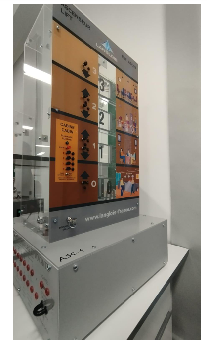
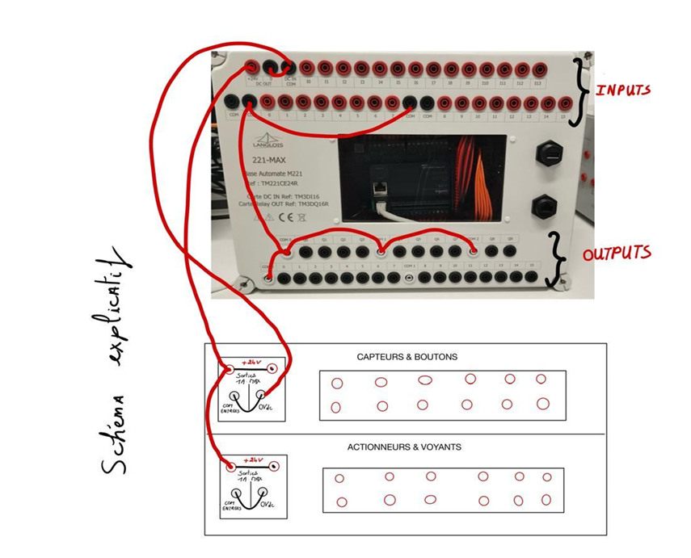
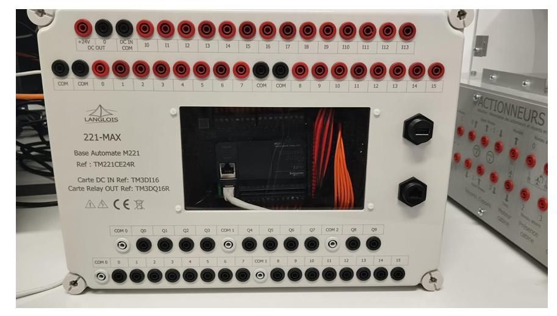
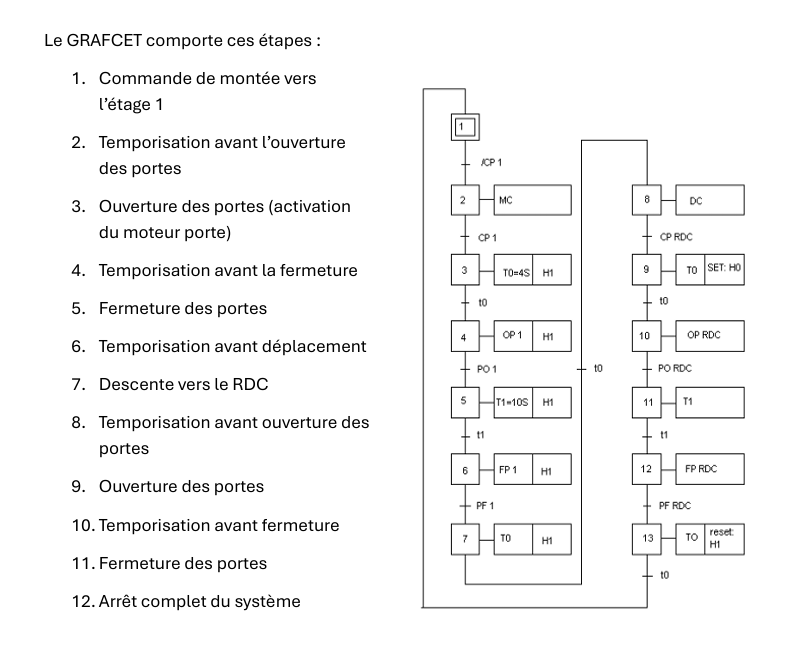
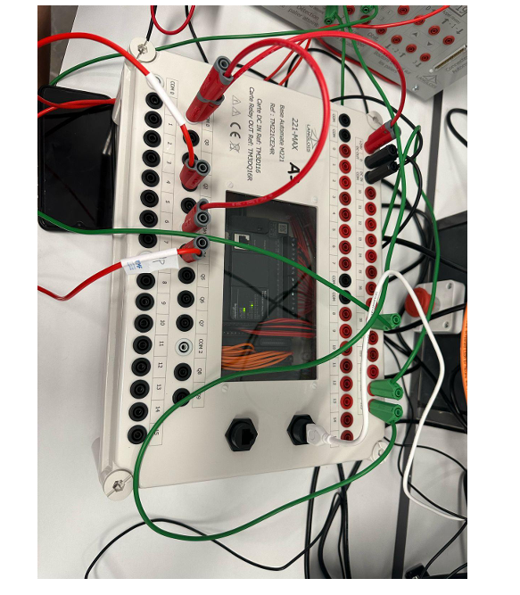
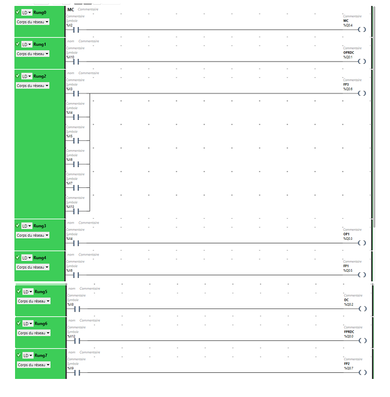

# 🏢 Elevator Control System - PLC Automation

### Industrial Programmable Logic Controller Project

*A comprehensive elevator automation system using GRAFCET methodology and Ladder programming*

[Features](#-features) • [Hardware](#%EF%B8%8F-hardware-specifications) • [Installation](#-installation) • [Documentation](#-documentation) • [Team](#-team)

---

## 📋 Table of Contents

- [Overview](#-overview)
- [Features](#-features)
- [Hardware Specifications](#%EF%B8%8F-hardware-specifications)
- [Software Requirements](#-software-requirements)
- [System Architecture](#-system-architecture)
- [Installation & Setup](#-installation--setup)
- [GRAFCET Logic](#-grafcet-logic)
- [Wiring Diagram](#-wiring-diagram)
- [Usage](#-usage)
- [Project Structure](#-project-structure)
- [Team](#-team)
- [License](#-license)

---

## 🎯 Overview

This project implements a complete **4-level elevator control system** using industrial automation standards. Developed as part of the Industrial Programmable Automation course at **Université Euro-Méditerranéenne de Fès**, the system demonstrates real-world PLC programming techniques using GRAFCET sequential control and Ladder logic.

### Key Objectives

- ✅ Automated cabin movement control (up/down)
- ✅ Intelligent door opening/closing sequences
- ✅ Position indicator lights for all floors
- ✅ Timed operations for safety and efficiency
- ✅ Emergency stop functionality
- ✅ Call button management from all floors

---

## ✨ Features

### 🚪 Door Control
- Automatic door opening upon arrival
- Configurable door open duration
- Smooth door closing with safety delays

### 🔼 Movement Control
- Multi-floor navigation (Ground + 3 floors)
- Optimized travel sequences
- Position feedback system

### 💡 Visual Indicators
- Floor position lights
- Direction indicators (up/down)
- Door status indicators

### ⏱️ Timing System
- Pre-opening delays
- Door hold time
- Pre-movement delays
- Safety timeouts

### 🛑 Safety Features
- Emergency stop button
- Door obstruction detection
- Sequential safety locks

---

## 🛠️ Hardware Specifications

### Programmable Logic Controller

| Component | Specification |
|-----------|--------------|
| **Model** | Schneider Electric Modicon TM221CE16R |
| **Type** | Compact PLC |
| **Power Supply** | 24V DC |
| **Digital Inputs** | TM3DI16 (16 channels) |
| **Digital Outputs** | TM3DQ16R (16 relay outputs) |

### Elevator Model

Here's an image of the elevator model:

| Component | Specification |
|-----------|--------------|
| **Model** | Langlois ASC4 |
| **Type** | Educational Elevator System |
| **Levels** | 4 (Ground + 3 floors) |
| **Features** | Call buttons, position sensors, door motors, indicator lights |
| **Connection** | Banana plug terminals |

---

## 💻 Software Requirements

- **EcoStruxure Machine Expert** (formerly SoMachine Basic)
  - Version: Latest stable release
  - License: Educational/Commercial
  
- **Programming Languages:**
  - GRAFCET (Sequential Function Chart)
  - Ladder Logic (LD)

---

## 🏗️ System Architecture

Here's an image showing the connection of the automate with the elevator:

\`\`\`
┌─────────────────────────────────────────────────────────┐
│                    Control System                        │
│                                                          │
│  ┌──────────────┐         ┌──────────────┐             │
│  │   Inputs     │         │   Outputs    │             │
│  │              │         │              │             │
│  │ • Floor      │         │ • Cabin      │             │
│  │   Buttons    │────────▶│   Motors     │             │
│  │ • Position   │   PLC   │ • Door       │             │
│  │   Sensors    │         │   Motors     │             │
│  │ • Door       │         │ • Indicator  │             │
│  │   Sensors    │         │   Lights     │             │
│  │ • E-Stop     │         │              │             │
│  └──────────────┘         └──────────────┘             │
│                                                          │
└─────────────────────────────────────────────────────────┘
\`\`\`

---

## 🔧 Installation & Setup

### 1. Hardware Assembly

#### Power Connection
\`\`\`
1. Connect 24V DC power supply to PLC
2. Verify power LED indicator
3. Connect ground reference
\`\`\`

#### Input Wiring
\`\`\`
• Connect +24V to input common (COM)
• Wire floor call buttons to digital inputs
• Connect position sensors to designated inputs
• Wire emergency stop to safety input
• Connect 0V to input common ground
\`\`\`

#### Output Wiring
\`\`\`
• Connect output common to 0V
• Wire cabin motor to relay outputs
• Connect door motors to designated outputs
• Wire indicator lights to output channels
\`\`\`

### 2. Software Configuration

#### Step 1: Create New Project
\`\`\`
1. Launch EcoStruxure Machine Expert
2. Create new project: "Elevator_Control_System"
3. Select controller: TM221CE16R
\`\`\`

#### Step 2: Configure Hardware
\`\`\`
1. Add TM3DI16 input module
2. Add TM3DQ16R output module
3. Verify module addressing
\`\`\`

#### Step 3: Define I/O Mapping

Here's an image of the PLC used:

**Input Assignments:**
| Symbol | Address | Description |
|--------|---------|-------------|
| BTN_FLOOR_0 | %I0.0 | Ground floor call |
| BTN_FLOOR_1 | %I0.1 | First floor call |
| BTN_FLOOR_2 | %I0.2 | Second floor call |
| BTN_FLOOR_3 | %I0.3 | Third floor call |
| SENSOR_DOOR | %I0.4 | Door position sensor |
| E_STOP | %I0.5 | Emergency stop |

**Output Assignments:**
| Symbol | Address | Description |
|--------|---------|-------------|
| MOTOR_UP | %Q0.0 | Cabin motor up |
| MOTOR_DOWN | %Q0.1 | Cabin motor down |
| DOOR_OPEN | %Q0.2 | Door opening motor |
| DOOR_CLOSE | %Q0.3 | Door closing motor |
| LIGHT_FLOOR_0 | %Q0.4 | Ground floor indicator |
| LIGHT_FLOOR_1 | %Q0.5 | First floor indicator |
| LIGHT_FLOOR_2 | %Q0.6 | Second floor indicator |
| LIGHT_FLOOR_3 | %Q0.7 | Third floor indicator |

#### Step 4: Program Upload
\`\`\`
1. Connect PC to PLC via USB/Ethernet
2. Compile the project
3. Download to PLC
4. Switch to RUN mode
\`\`\`

---

## 📊 GRAFCET Logic

### Main Sequence Flow

Here's the GRAFCET for the project:

\`\`\`
┌─────────────────────────────────────────────────────────┐
│                    GRAFCET Sequence                      │
├─────────────────────────────────────────────────────────┤
│                                                          │
│  [0] Initial State - Cabin at Ground Floor              │
│       │                                                  │
│       ├─ Condition: Floor 1 Button Pressed              │
│       ▼                                                  │
│  [1] Activate Motor UP                                  │
│       │                                                  │
│       ├─ Condition: Cabin reaches Floor 1               │
│       ▼                                                  │
│  [2] Pre-Opening Delay (T1 = 2s)                        │
│       │                                                  │
│       ├─ Condition: Timer T1 elapsed                    │
│       ▼                                                  │
│  [3] Open Doors                                         │
│       │                                                  │
│       ├─ Condition: Doors fully open + Hold time        │
│       ▼                                                  │
│  [4] Door Hold Delay (T2 = 5s)                          │
│       │                                                  │
│       ├─ Condition: Timer T2 elapsed                    │
│       ▼                                                  │
│  [5] Close Doors                                        │
│       │                                                  │
│       ├─ Condition: Doors fully closed                  │
│       ▼                                                  │
│  [6] Pre-Movement Delay (T3 = 1s)                       │
│       │                                                  │
│       ├─ Condition: Timer T3 elapsed                    │
│       ▼                                                  │
│  [7] Activate Motor DOWN                                │
│       │                                                  │
│       ├─ Condition: Cabin reaches Ground Floor          │
│       ▼                                                  │
│  [8] Pre-Opening Delay (T4 = 2s)                        │
│       │                                                  │
│       ├─ Condition: Timer T4 elapsed                    │
│       ▼                                                  │
│  [9] Open Doors                                         │
│       │                                                  │
│       ├─ Condition: Doors fully open + Hold time        │
│       ▼                                                  │
│  [10] Door Hold Delay (T5 = 5s)                         │
│       │                                                  │
│       ├─ Condition: Timer T5 elapsed                    │
│       ▼                                                  │
│  [11] Close Doors                                       │
│       │                                                  │
│       ├─ Condition: Doors fully closed                  │
│       ▼                                                  │
│  [12] System Complete - Return to Initial State         │
│                                                          │
└─────────────────────────────────────────────────────────┘
\`\`\`

### Timer Configuration

| Timer | Duration | Purpose |
|-------|----------|---------|
| T1 | 2 seconds | Pre-opening delay after arrival |
| T2 | 5 seconds | Door hold time for passenger entry/exit |
| T3 | 1 second | Safety delay before movement |
| T4 | 2 seconds | Pre-opening delay at destination |
| T5 | 5 seconds | Door hold time at ground floor |

---

## 🔌 Wiring Diagram

### Power Distribution

\`\`\`
┌─────────────────────────────────────────────────────────┐
│                   Power Supply 24V DC                    │
└────────────┬────────────────────────────┬────────────────┘
             │                            │
             │ +24V                       │ 0V
             │                            │
    ┌────────▼────────┐          ┌───────▼────────┐
    │  Input Common   │          │ Output Common  │
    │     (COM)       │          │     (COM)      │
    └────────┬────────┘          └───────┬────────┘
             │                            │
    ┌────────▼────────┐          ┌───────▼────────┐
    │  Input Devices  │          │    Actuators   │
    │  • Buttons      │          │  • Motors      │
    │  • Sensors      │          │  • Lights      │
    └─────────────────┘          └────────────────┘
\`\`\`

### Connection Summary

Here's another image related to connections or a general overview:

- **Inputs:** All input devices share +24V common, individual returns to PLC inputs
- **Outputs:** All output devices share 0V common, individual supplies from PLC relay outputs
- **Isolation:** Input and output circuits are electrically isolated for safety

---

## 🚀 Usage

### Starting the System

1. **Power On**
   - Ensure PLC is powered (24V DC)
   - Verify all indicator lights are functional
   - Check emergency stop is released

2. **Initialize**
   - Cabin should be at ground floor
   - All doors should be closed
   - Ground floor indicator should be lit

3. **Operation**
   - Press desired floor button
   - System automatically handles:
     - Cabin movement
     - Door operations
     - Position indication
     - Safety delays

### Emergency Procedures

- **Emergency Stop:** Press E-STOP button to immediately halt all operations
- **Reset:** Release E-STOP and press reset to resume normal operation
- **Manual Override:** Available through maintenance mode (if implemented)

---

## 📁 Project Structure

\`\`\`
elevator-control-system/
│
├── README.md                    # This file
├── docs/
│   ├── TP1_Report.pdf          # Lab 1 - Initial Setup
│   ├── TP3_Report.pdf          # Lab 3 - Complete System
│   ├── wiring_diagrams/        # Detailed wiring schematics
│   └── grafcet_diagrams/       # GRAFCET flow charts
│
├── src/
│   ├── TP1_Basic_Control.smbp  # Basic elevator control
│   ├── TP3_Full_System.smbp    # Complete system with doors
│   └── ladder_logic/           # Ladder diagram exports
│
├── hardware/
│   ├── io_mapping.xlsx         # I/O assignment table
│   └── parts_list.md           # Bill of materials
│
└── simulation/
    └── test_scenarios.md       # Test cases and validation
\`\`\`

---

## 📚 Documentation

### Lab Reports

- **TP1:** Initial hardware setup and basic control logic
- **TP3:** Complete system with door control and position indicators

### Reference Materials

- [Schneider Electric TM221 Documentation](https://www.se.com)
- [EcoStruxure Machine Expert User Guide](https://www.se.com/ww/en/product-range/61971-ecostruxure-machine-expert/)
- [GRAFCET Standard IEC 60848](https://webstore.iec.ch/publication/3684)
- [Ladder Logic Programming Guide](https://www.plcacademy.com/ladder-logic-tutorial/)

---

## 🔒 Safety Considerations

Here's the ladder diagram for the project:

⚠️ **Important Safety Notes:**

- Always ensure emergency stop is functional before operation
- Never bypass safety interlocks
- Maintain proper electrical isolation between input and output circuits
- Follow lockout/tagout procedures during maintenance
- Verify all connections before applying power
- Keep hands clear of moving parts during operation

---

## 🛡️ License

This project is developed for educational purposes as part of the Industrial Automation curriculum at Université Euro-Méditerranéenne de Fès.

**Academic Use:** Free to use and modify for educational purposes  
**Commercial Use:** Requires permission from the development team and university

---

## 🤝 Contributing

While this is primarily an academic project, we welcome suggestions and improvements:

1. Fork the repository
2. Create a feature branch (`git checkout -b feature/improvement`)
3. Commit your changes (`git commit -m 'Add improvement'`)
4. Push to the branch (`git push origin feature/improvement`)
5. Open a Pull Request

---

### ⭐ If you find this project useful, please consider giving it a star!

**Made with ❤️ by UEMF Robotics Students**

